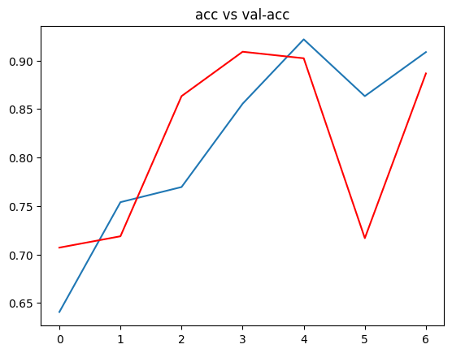
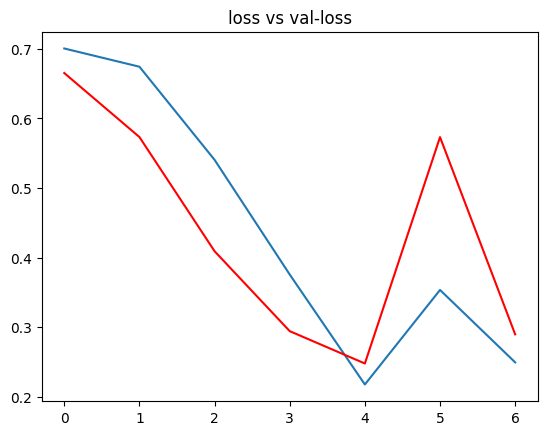

# CNN Tumor Classifier

This project demonstrates the development, training, and evaluation of a Convolutional Neural Network (CNN) using transfer learning for image classification. It includes preprocessing, model building, and analysis of results using a Kaggle dataset.

## Overview

This project focuses on detecting brain tumors from medical images using deep learning techniques, specifically a **Convolutional Neural Network (CNN)**. It addresses the challenge of automating brain tumor classification, a critical step in assisting medical professionals with early and accurate diagnosis. The entire implementation is documented in the notebook `Brain_Tumor_Detection.ipynb`.
## Key Highlights

- **Transfer Learning with MobileNet**:
    - Initially implemented a standard CNN architecture that achieved an accuracy of **86%** on the validation set.
    - By leveraging **MobileNet**, a lightweight and efficient pre-trained CNN, and applying transfer learning techniques, the performance improved significantly to **95% accuracy**.
- **Data Augmentation**: Enhanced model generalization and robustness using advanced augmentation techniques such as rotation, flipping, zooming, and shifting.
- **Performance Metrics**: Comprehensive evaluation of the model's performance using:
    - **Accuracy and Loss Curves**: To monitor and visualize model training and validation.
- **Medical Significance**: Demonstrates the potential of deep learning in healthcare by automating brain tumor detection, reducing diagnostic time, and increasing accuracy.

## Dataset 

This project uses a publicly available brain tumor dataset from Kaggle.

- **Dataset Name**: [Brain Tumor MRI Dataset](https://www.kaggle.com/datasets/masoudnickparvar/brain-tumor-mri-dataset)
- **Description**: The dataset contains medical images categorized into four classes:
    - **Giioma**: Images containing visible brain tumors.
    - **Meningioma**: Images containing visible brain tumors.
    - **Pituitary**: Images containing visible brain tumors.
    - **No Tumor**: Normal brain images without visible abnormalities.

## Results

The trained model achieved impressive performance on the validation set, demonstrating its effectiveness in brain tumor detection.

- **Accuracy**: **95.96%**
- **Loss**: **0.3818**

### **Summary of Results**

- The model successfully classified brain tumor images with high accuracy, achieving an overall accuracy of **95.96%** on the validation dataset.
- The relatively low loss value (**0.3818**) indicates that the model effectively minimized errors during training and validation.

### Visualizations

To better understand the model's performance, the following visualizations are included:

**Accuracy and Loss Curves**:  
    These curves illustrate the training and validation accuracy and loss over each epoch, highlighting the model's convergence and generalization performance.
   
   

   
   
## Dependecies

This project requires the following Python packages:

- TensorFlow
- Keras
- NumPy
- Matplotlib

## License

